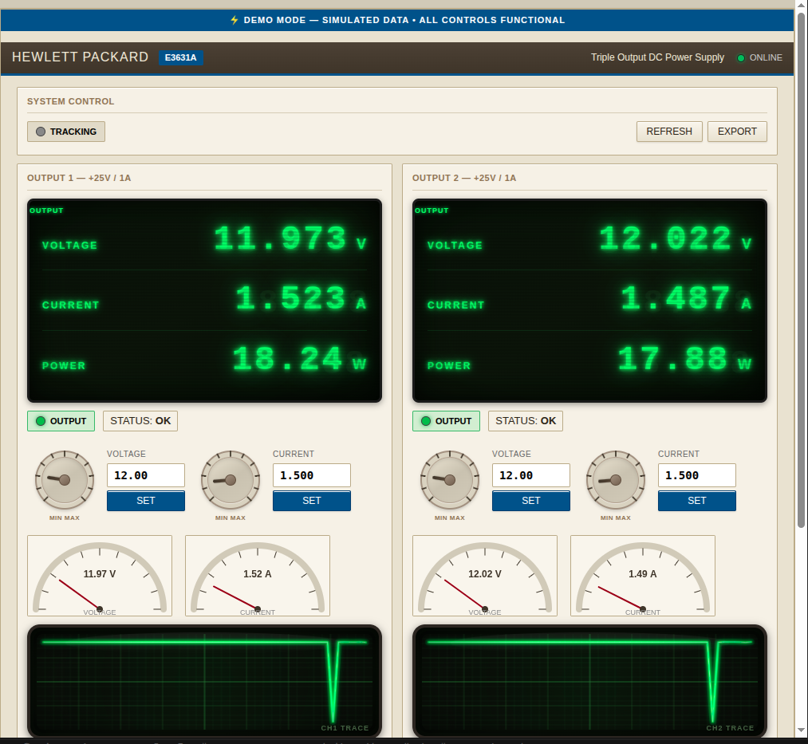

# SK120x Web Controller (ESP32 + RS485 + Modbus)

This project provides a **web-based controller** for the [SK120X DC Regulated Power Supply DC-DC Step Up/Down Converter](https://www.amazon.com/SK120X-Regulated-Stabilized-Voltage-Converter/dp/B0F18HZD97) using an **ESP32**, **RS485 transceiver**, and **Modbus RTU**.


---

## ✨ Features
- 📡 WiFi connectivity (station or fallback access point mode)  
- 🌐 Embedded web interface (HTML/CSS/JS served directly from ESP32)  
- ⚡ Live monitoring of:
  - Set Voltage / Current  
  - Output Voltage / Current / Power  
  - Output state (ON/OFF)  
  - MPPT (experimental)  
- 🎛️ Remote control of:
  - Voltage & Current setpoints  
  - Output toggle  
  - MPPT enable/disable  
- 📊 Built-in charts:
  - Voltage/Current history line chart  
  - Voltage histogram  
- 🔍 Register scanner with CSV export  
- 🛠️ Modular HTML UI (panels, gauges, seven-segment style readouts)

---

## 🖥️ Web Interface Preview



- **Top Row:** Current status, setpoints, toggle controls  
- **Middle Row:** Voltage/Current history chart, histogram  
- **Bottom Row:** Modbus register scanner with CSV export  

The UI is entirely self-contained (no CDN or external JS), ensuring it works offline once loaded.

---

## ⚙️ Hardware Setup
- **ESP32** development board  
- **RS485 transceiver module** (DE/RE control supported, configurable)  
- **SK120X DC-DC Power Supply**  

**Pin Mapping (default):**
| Signal        | ESP32 Pin |
|---------------|-----------|
| UART RX       | 16        |
| UART TX       | 17        |
| RS485 DE/RE   | 4         |
| Baudrate      | 115200    |

---

## 🔌 Software Setup
1. Install [Arduino IDE](https://www.arduino.cc/en/software) with ESP32 board support  
2. Install libraries:  
   - `ModbusMaster`  
   - `WebServer` (comes with ESP32 Arduino core)  
3. Update your WiFi credentials in the sketch:  
   ```cpp
   const char *WIFI_SSID = "YOUR_WIFI_SSID";
   const char *WIFI_PASS = "YOUR_WIFI_PASSWORD";
Compile & upload to your ESP32.

Open Serial Monitor to see IP address (or connect to fallback AP SK120x-ESP32).

Navigate to the IP address in your browser to access the web UI.

📡 API Endpoints

GET / → Web UI

GET /api/status → JSON with live status

POST /api/write?reg=X&val=Y → Write Modbus register

GET /api/scan?start=A&end=B → Scan Modbus registers

📝 Notes

MPPT support is experimental – some SK120x firmware revisions may not implement it.

Register scanner helps discover unknown registers and their values.

The project mimics LabVIEW-style panels for readability and modular control.

📚 Resources

SK120X DC Power Supply on Amazon

📜 License

MIT License – free to use, modify, and share.