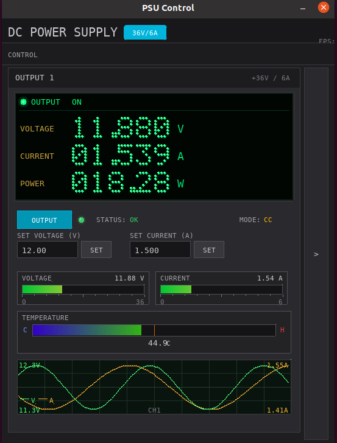
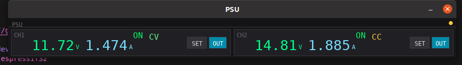

# PSU Control GUI — SDL2 Application

Standalone C GUI for controlling DC power supplies via a serial-to-Modbus bridge (ESP32). Two **full** layouts (dual- or single-channel) and two **toolbar** layouts (dual- or single-channel) share the same serial stack (`serial_port`, `psu_protocol`).

The full GUI mimics a bench-instrument style: VFD-style readouts, bar meters, temperature strip, scope traces, keypad, and setpoint controls.

## Screenshots

Images are stored under **`../docs/images/psu-gui/`** (repo root) so they render correctly in **GitHub**, **Cursor/VS Code** preview, and other viewers that resolve paths from the workspace root. Duplicate copies for packaging: `psu-gui/screenshots/`.

### Full GUI — dual channel (`psu_gui`)

Two **OUTPUT** panels (CH1 / CH2), shared keypad, **SYSTEM CONTROL** toolbar with **TRACKING**, header **DUAL OUTPUT DC POWER SUPPLY**.


### Full GUI — single channel (`psu_gui_single`)

Compact window: one **OUTPUT 1** panel, **CONTROL** toolbar (no tracking), title **DC POWER SUPPLY**, collapsible keypad (**`<`** on the keypad bar to hide, **`>`** strip to show again).



### Toolbar — dual channel (`psu_gui_toolbar`)

Minimal strip: **CH1** and **CH2** side by side, large V/A readouts, **SET** popup for setpoints, **OUT** per channel.



### Toolbar — single channel (`psu_gui_toolbar_single`)

Same toolbar interaction as above, but one row (**OUT** label), **SET** / **OUT**, hardware **channel 1** only; no separate screenshot here.

### Legacy filenames

Under `screenshots/`, older names may include `psu_gui.png` or `psu_gui_toolbar.png`. The files above match **`full-gui-dual.png`**, **`full-gui-single.png`**, and **`toolbar-dual.png`** in `docs/images/psu-gui/` and `screenshots/`.

---

## Binaries

| Binary | Source | Description |
| ------ | ------ | ----------- |
| `psu_gui` | `main.c` | Dual output: two panels, keypad, **TRACKING**, **SYSTEM CONTROL** |
| `psu_gui_single` | `main_single.c` | Single output: one panel, collapsible keypad, **CONTROL** only |
| `psu_gui_toolbar` | `main_toolbar.c` | Minimal strip: **CH1** / **CH2**, large V/A, SET popup |
| `psu_gui_toolbar_single` | `main_toolbar_single.c` | Same toolbar UX for **one** channel (hardware ch 1) |

`make all` builds all four. After `make`, you can copy binaries into the project `bin/` tree if you keep release artifacts there.

---

## Features

### Full GUI (`psu_gui` / `psu_gui_single`)

- **VFD display** — Voltage, current, power with green-on-black style  
- **Bar meters** — Voltage and current vs full-scale  
- **Temperature** — Gradient bar with warning behavior  
- **Scope traces** — Voltage (green) and current (yellow) on one timebase  
- **OUTPUT** toggle, **SET VOLTAGE** / **SET CURRENT** fields and buttons  
- **Keypad** — Numeric entry for setpoints (dual GUI: CH1/CH2 toggle; single GUI: CH1 only, collapsible panel)  
- **Demo mode** — Simulated data if the serial port cannot be opened  

Dual GUI only:

- **TRACKING** — Link Ch1 settings to Ch2 (`LINK` command)

### Toolbar GUI (`psu_gui_toolbar` / `psu_gui_toolbar_single`)

- Large **V** and **A** readouts, **ON/OFF**, **CV/CC**, **ERR** when invalid  
- **OUT** toggles output; **SET** opens a modal for V/A setpoints (**APPLY**, **CANCEL**, click outside, **Esc**)  
- Window height grows while the popup is open  

---

## Dependencies

Install SDL2 and SDL2_ttf:

```bash
# Ubuntu/Debian
sudo apt install libsdl2-dev libsdl2-ttf-dev

# Fedora
sudo dnf install SDL2-devel SDL2_ttf-devel

# Arch
sudo pacman -S sdl2 sdl2_ttf
```

A monospace font is required (DejaVu Sans Mono or Liberation Mono is auto-detected from common paths).

---

## Build

```bash
cd psu-gui
make              # all four binaries
make psu_gui
make psu_gui_single
make psu_gui_toolbar
make psu_gui_toolbar_single
make clean
```

---

## Run

```bash
# Default port /dev/ttyUSB0; demo if port missing
./psu_gui
./psu_gui_single
./psu_gui_toolbar
./psu_gui_toolbar_single

# Explicit serial device
./psu_gui /dev/ttyUSB0
./psu_gui_single /dev/ttyACM0
./psu_gui_toolbar /dev/ttyUSB0
./psu_gui_toolbar_single /dev/ttyUSB0

# Help
./psu_gui --help
```

Single-channel programs only use **channel 1** on the wire (`STATUS 1`, `WRITE 1 …`, etc.).

---

## Serial protocol

The GUI talks to the ESP32 with the text-based serial protocol:

| Command | Description |
| ------- | ----------- |
| `STATUS <ch>` | Read channel status |
| `WRITE <ch> <reg> <val>` | Write register |
| `LINK` | Copy Ch1 to Ch2 (dual full GUI **TRACKING** only) |

See the ESP32 firmware README for full protocol details.

---

## Controls (full GUI)

- **OUTPUT** — Toggle output on/off  
- **SET VOLTAGE / SET CURRENT** — Click field, type value, **SET** or **Enter**  
- **Keypad** — Type digits; **VOLTS** / **AMPS** mode; **OK** applies (single build: keypad hide/show via top tab **`<`** / strip **`>`**)  
- **TRACKING** — Dual `psu_gui` only: mirror Ch1 to Ch2  
- **REFRESH** — Reserved / UI hook  

---

## Code structure

| File | Role |
| ---- | ---- |
| `main.c` | Dual-channel full SDL2 GUI |
| `main_single.c` | Single-channel full GUI (includes shared drawing from `main.c` with its own `main` and layout) |
| `main_toolbar.c` | Dual-channel compact toolbar |
| `main_toolbar_single.c` | Single-channel compact toolbar |
| `serial_port.c` / `serial_port.h` | Linux serial port |
| `psu_protocol.c` / `psu_protocol.h` | Commands, parsing, background poll thread |

---

## License

MIT
